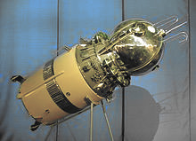

# NEAR Vostok DAO

A simple, on-chain multisig NEAR wallet.
It's made for humans to execute NEAR transfers.

For more complex functionality or complex DAOs you should probably look at the [Sputnik DAO](https://github.com/near-daos/sputnik-dao-contract).

## Status

Beta. Unit tests done.

### Roadmap

Version 1: [Done]
+ Simple DAO (fixed signers / voters)
+ NEAR transfers.

Version 2:
+ Fungible Token (NEP-141) transfers.

## Name

[Vostok 1](https://en.wikipedia.org/wiki/Vostok_1) was the first spaceflight of the Vostok programme and the first human spaceflight in history. The Vostok 3KA space capsule was launched from Baikonur Cosmodrome on April 12, 1961, with Soviet cosmonaut Yuri Gagarin aboard, making him the first human to cross into outer space.

## Contributions

All code is open source under Mozilla Public License v2.

To contribute, create a pull request.
